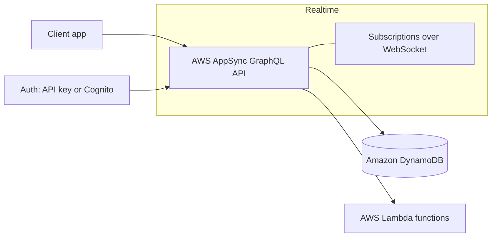
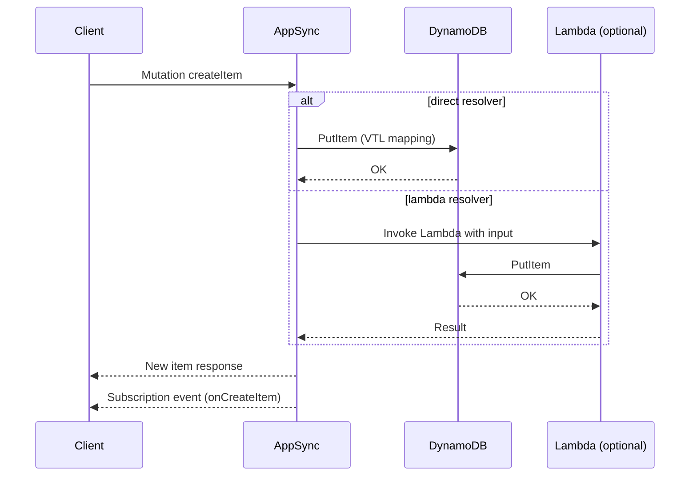

# Hackathon — AppSync GraphQL API ⚡️

A hackathon-ready, serverless GraphQL stack on **AWS AppSync** with real-time subscriptions, backed by **Amazon DynamoDB** and optional **AWS Lambda** resolvers. Includes a lightweight client to demo Queries, Mutations, and Subscriptions.

## Features

- **GraphQL API (AppSync)** with Queries, Mutations, and Subscriptions  
- **Real-time updates** via AppSync WebSockets  
- **DynamoDB** tables for scalable persistence  
- Optional **AWS Lambda** for custom business logic or pipeline resolvers  
- **Auth** via API Key (hackathon default) or Cognito (for user login)  
- **One-command deploy** with AWS Amplify CLI or SAM

## Tech Stack

- **AWS AppSync** (GraphQL API)  
- **Amazon DynamoDB** (storage)  
- **AWS Lambda** (resolvers / business logic, optional)  
- **AWS CloudFormation / SAM** or **Amplify CLI** (infrastructure as code)  
- **Client**: React / React Native / simple HTML+JS using `@aws-amplify/api-graphql` or `aws-appsync` client

## Quick Start

> Choose **Amplify** (fastest for hackathons) or **SAM/CloudFormation**.

### Option A — Amplify CLI

```bash
# 1) Install Amplify CLI
npm i -g @aws-amplify/cli

# 2) Configure Amplify (one-time setup)
amplify configure

# 3) Initialize your project
amplify init

# 4) Add a GraphQL API
amplify add api
# ? Select: GraphQL
# ? Auth type: API key (for hackathon) or Cognito
# ? Provide a schema: guided or import ./amplify/backend/api/schema.graphql

# 5) Deploy to AWS
amplify push
```

### Option B:
# Build and deploy
sam build
sam deploy --guided

# Follow prompts; outputs AppSync GraphQL endpoint and API key if configured

## Configuration

- **API Key**: simplest for hackathon demos.  
- **Cognito User Pools**: recommended if you need authentication and per-user access.

Update your client `.env` or config file with:
APPSYNC_API_URL=your_graphql_endpoint
APPSYNC_API_KEY=your_api_key # if using API key
APPSYNC_REGION=your_region

##  Example GraphQL Schema (CRUD)

```graphql
type Item @model @auth(rules: [{ allow: public }]) {
  id: ID!
  title: String!
  description: String
  createdAt: AWSDateTime
  updatedAt: AWSDateTime
}

type Subscription {
  onCreateItem: Item @subscribe(mutations: ["createItem"])
  onUpdateItem: Item @subscribe(mutations: ["updateItem"])
  onDeleteItem: Item @subscribe(mutations: ["deleteItem"])
}
```

##  Client Usage (React Example)

Install dependencies:
```bash
npm i aws-amplify @aws-amplify/api-graphql

// src/amplifyClient.ts
import { Amplify } from 'aws-amplify';
import { generateClient } from 'aws-amplify/api';

Amplify.configure({
  API: {
    GraphQL: {
      endpoint: import.meta.env.VITE_APPSYNC_API_URL,
      region: import.meta.env.VITE_APPSYNC_REGION,
      defaultAuthMode: 'apiKey', // or 'userPool' if using Cognito
      apiKey: import.meta.env.VITE_APPSYNC_API_KEY,
    },
  },
});

export const gqlClient = generateClient();


```
##  Architecture



## 🔄 Request Flow




